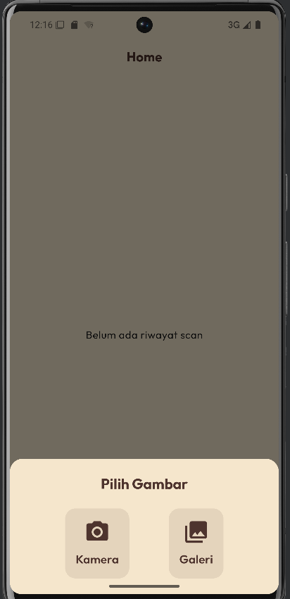
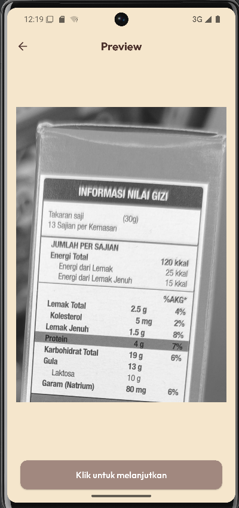
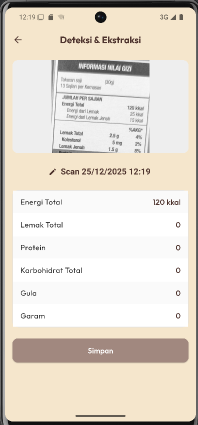
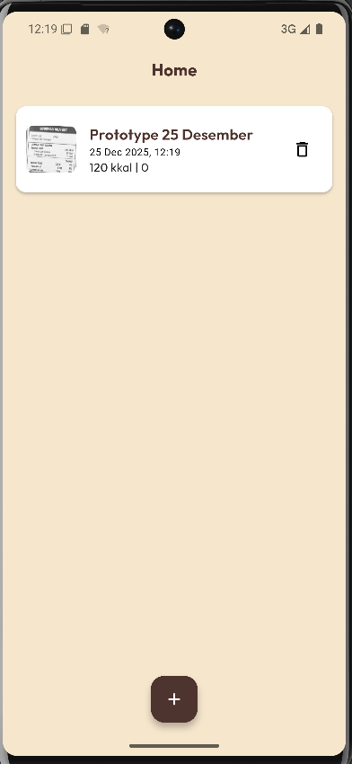

# Six Scan

Six Scan is a mobile application designed to help users make healthier food choices by scanning nutrition labels. Built with Flutter for the frontend and powered by a robust FastAPI backend, it leverages advanced AI technologies to extract and analyze nutritional information.

## 🚀 Features

-   **Smart Scanning**: Capture images of nutrition labels using your device's camera or select from the gallery.
-   **AI-Powered Detection**: Utilizes YOLOv11 for precise object detection to locate nutrition tables.
-   **OCR Text Extraction**: Integrates EasyOCR to read and parse text from the cropped labels.
-   **Nutritional Analysis**: Automatically extracts key values like Sugar, Salt, Fat, Energy, and Protein.
-   **Health Grading**: Provides an instant assessment (e.g., "Healthy", "Moderate", "Unhealthy") based on the scanned data.
-   **History Tracking**: Saves your scan history locally so you can review past items anytime.

## 🛠️ Tech Stack

### Mobile App (Frontend)
-   **Framework**: [Flutter](https://flutter.dev/)
-   **Language**: Dart
-   **Architecture**: MVVM (Model-View-ViewModel) with Clean Architecture principles.
-   **State Management**: Provider
-   **Local Storage**: SQFlite
-   **Networking**: Dio

### Backend (API)
-   **Framework**: [FastAPI](https://fastapi.tiangolo.com/)
-   **Language**: Python
-   **Object Detection**: YOLOv11 (Ultralytics)
-   **OCR**: EasyOCR
-   **Image Processing**: OpenCV, PIL

## 📦 Getting Started

### Prerequisites
-   [Flutter SDK](https://docs.flutter.dev/get-started/install) installed.
-   Android Studio or VS Code configured for Flutter development.
-   A running instance of the Six Scan Backend (see backend repository for setup).

### Installation

1.  **Clone the repository**
    ```bash
    git clone https://github.com/yourusername/six-scan.git
    cd six-scan
    ```

2.  **Install dependencies**
    ```bash
    flutter pub get
    ```

3.  **Configure Backend URL**
    -   Open `lib/core/constants/api_constants.dart` (or equivalent configuration file).
    -   Update the `baseUrl` to point to your backend server (e.g., `http://10.0.2.2:8000` for Android emulator).

4.  **Run the App**
    ```bash
    flutter run
    ```

## 📸 Screenshots

| Home Screen | Camera Scan | Result Details | History |
|:-----------:|:-----------:|:--------------:|:-------:|
|  |  |  |  |

*(Note: Add actual screenshots to a `docs/screenshots` folder in your repo to populate this table)*

## 🤝 Contributing

Contributions are welcome! Please feel free to submit a Pull Request.
